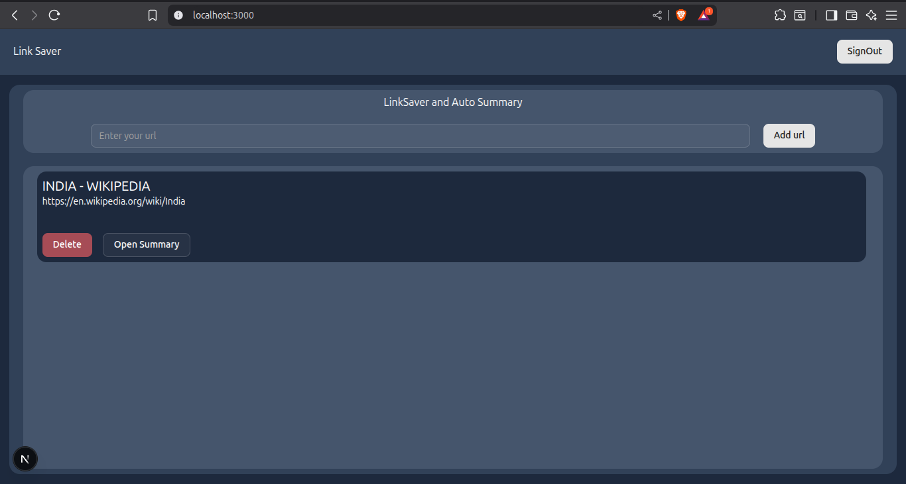
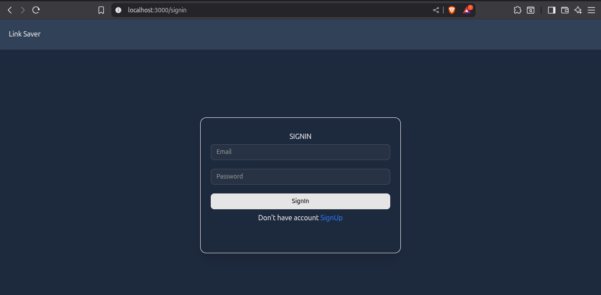
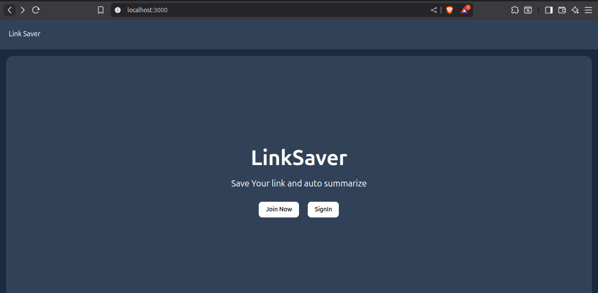

````markdown
# 🔖 Bookmark Saver App

A full-stack web app built using **Next.js App Router**, **Tailwind CSS v4**, **MongoDB**, **JWT Auth**, and **Jina AI** to save, summarize, and manage bookmarks.

---

## 🚀 Features

- 🔐 User Authentication with JWT (Firebase + custom backend)
- 🌐 Save any URL → Auto fetch title, favicon, OpenGraph image
- ✍️ Auto-summarize articles using [Jina AI](https://jina.ai/)
- 📂 View all saved bookmarks (persisted in MongoDB)
- 🗑️ Delete individual bookmarks
- 📦 Fully Responsive UI with ShadCN UI

---

## 🧰 Tech Stack

| Tech              | Used For              |
|------------------|-----------------------|
| Next.js 15 (App Router) | Frontend & API Routes |
| Tailwind CSS v4  | Styling (dark mode + responsiveness) |
| MongoDB + Mongoose | Database              |
| Firebase         | JWT Token (client-side) |
| Axios            | API requests           |
| cheerio + axios  | Web scraping metadata  |
| Jina AI          | Article summarization  |
| ShadCN UI        | Components (modals, buttons, dropdowns) |
| next-themes      | Dark/light mode toggle |

---

## 📦 Installation

```bash
git clone https://github.com/yourusername/bookmark-app.git
cd bookmark-app
npm install
````

---

## 🧪 Setup Environment Variables

Create `.env.local` and add:

```env
NEXT_PUBLIC_FIREBASE_API_KEY
NEXT_PUBLIC_FIREBASE_AUTH_DOMAIN
NEXT_PUBLIC_FIREBASE_PROJECT_ID
NEXT_PUBLIC_FIREBASE_STORAGE_BUCKET
NEXT_PUBLIC_FIREBASE_MESSAGING_SENDER_ID
NEXT_PUBLIC_FIREBASE_APP_ID
NEXT_PUBLIC_FIREBASE_MEASUREMENT
JWT_SECRET
MONGODB_URI=mongodb://localhost:27017/test
```

---

## 🧠 API Endpoints

### ➕ Save Bookmark

`POST /api/bookmark/fetch`


* Requires `Authorization: Bearer <token>`

### 📥 Fetch Bookmarks

`GET /api/bookmark/fetchAll` — returns all bookmarks of the user

### ❌ Delete Bookmark

`DELETE /api/bookmark/fetchDelete/[id]`

---

## 💡 Future Ideas

* ✅ Bookmark Tags & Categories
* 🗂️ Folder-like organization
* 🔍 Search Bookmarks
* 🔐 Google Auth / Firebase UI

---

## 📸 Screenshots





---

## 🧑‍💻 Author

Made by [Navneet Shahi](https://github.com/navneetshahi14)

```
